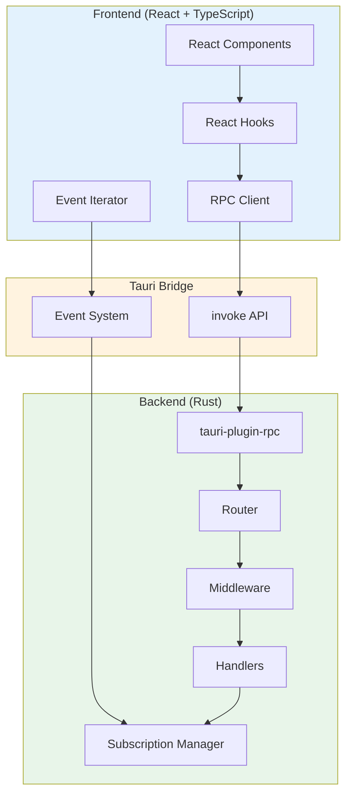
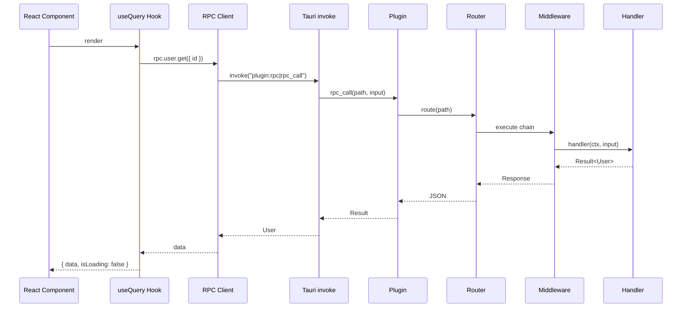
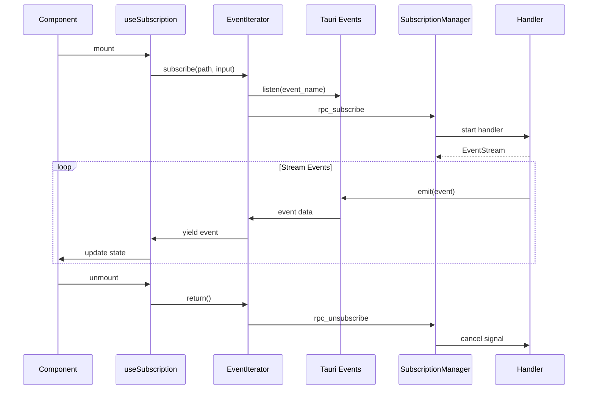

<p align="center">
  
</p>

<h1 align="center">⚡ Tauri RPC Demo</h1>

<p align="center">
  <strong>A production-ready Tauri v2 application showcasing type-safe RPC communication</strong>
</p>

<p align="center">
  
  
  
  
  
</p>

---

## 🎯 Overview

This project demonstrates a complete, production-ready RPC system for Tauri v2 applications with:

- **Type-safe communication** between Rust backend and TypeScript frontend
- **Real-time subscriptions** with async iterators and auto-reconnect
- **React hooks** for queries, mutations, and subscriptions
- **Middleware support** for logging, authentication, and more
- **Structured error handling** with typed error codes

---

## 🏗️ Architecture



---

## ✨ Features

| Feature                | Description                                    |
| ---------------------- | ---------------------------------------------- |
| 🔒 **Type-Safe RPC**   | End-to-end type safety from Rust to TypeScript |
| 📡 **Subscriptions**   | Real-time streaming with backpressure handling |
| ⚛️ **React Hooks**     | `useQuery`, `useMutation`, `useSubscription`   |
| 🔗 **Middleware**      | Logging, auth, rate limiting support           |
| 🛡️ **Error Handling**  | Structured errors with typed codes             |
| ⚡ **Compiled Router** | Pre-built middleware chains for O(1) execution |
| 🔄 **Auto-Reconnect**  | Resilient subscription connections             |

---

## 📁 Project Structure

```
tauri-rpc-demo/
├── src/                          # Frontend (React + TypeScript)
│   ├── lib/
│   │   └── rpc/                  # RPC Client Library
│   │       ├── client.ts         # Client implementation
│   │       ├── hooks.ts          # React hooks
│   │       ├── event-iterator.ts # Subscription handling
│   │       └── types.ts          # Type definitions
│   ├── rpc/
│   │   └── contract.ts           # Contract definition
│   ├── routes/                   # TanStack Router pages
│   │   ├── streams/              # Subscription demos
│   │   │   ├── counter.tsx       # Counter stream
│   │   │   ├── stocks.tsx        # Stock prices
│   │   │   ├── chat.tsx          # Chat room
│   │   │   └── time.tsx          # Server time
│   │   └── ...
│   └── components/               # React components
│
├── src-tauri/                    # Backend (Rust)
│   ├── src/
│   │   ├── lib.rs                # Tauri setup
│   │   └── rpc/
│   │       ├── mod.rs            # Module exports
│   │       ├── context.rs        # App context
│   │       ├── handlers.rs       # RPC handlers
│   │       └── types.rs          # Rust types
│   └── capabilities/
│       └── default.json          # Permissions
│
└── tauri-plugin-rpc/             # RPC Plugin
    └── src/
        ├── lib.rs                # Plugin exports
        ├── router.rs             # Router implementation
        ├── subscription.rs       # Subscription system
        ├── middleware.rs         # Middleware types
        └── error.rs              # Error handling
```

---

## 🚀 Quick Start

### Prerequisites

- [Rust](https://rustup.rs/) (1.70+)
- [Node.js](https://nodejs.org/) (18+)
- [Bun](https://bun.sh/) (recommended) or npm/yarn

### Installation

```bash
# Clone the repository
git clone <repository-url>
cd tauri-rpc-demo

# Install frontend dependencies
bun install

# Run in development mode
bun tauri dev
```

### Build for Production

```bash
bun tauri build
```

---

## 📖 Documentation

| Document                                                   | Description                     |
| ---------------------------------------------------------- | ------------------------------- |
| [tauri-plugin-rpc/README.md](./tauri-plugin-rpc/README.md) | Rust plugin documentation       |
| [src/lib/rpc/README.md](./src/lib/rpc/README.md)           | TypeScript client documentation |

---

## 🎮 Demo Features

### Queries & Mutations

```typescript
// Type-safe queries
const user = await rpc.user.get({ id: 1 });
const users = await rpc.user.list();

// Type-safe mutations
const newUser = await rpc.user.create({
  name: "Alice",
  email: "alice@example.com",
});
```

### Subscriptions

```typescript
// Counter stream
const stream = await rpc.stream.counter({
  start: 0,
  maxCount: 100,
  intervalMs: 500,
});

for await (const event of stream) {
  console.log(`Count: ${event.count}`);
}
```

### React Hooks

```tsx
// Query hook
const { data, isLoading, error } = useQuery(() => rpc.user.get({ id }), [id]);

// Mutation hook
const { mutate, isLoading } = useMutation(rpc.user.create);

// Subscription hook
const { data, isConnected } = useSubscription(
  () => subscribe("stream.counter", input),
  [],
);
```

---

## 🛠️ Development

### IDE Setup

- [VS Code](https://code.visualstudio.com/)
- [Tauri Extension](https://marketplace.visualstudio.com/items?itemName=tauri-apps.tauri-vscode)
- [rust-analyzer](https://marketplace.visualstudio.com/items?itemName=rust-lang.rust-analyzer)

### Commands

```bash
# Development
bun tauri dev

# Build
bun tauri build

# Run tests
bun test

# Generate Rust docs
cd tauri-plugin-rpc && cargo doc --open
```

---

## 📊 Request Flow



---

## 📡 Subscription Flow



---

## 🔧 Configuration

### Tauri Permissions

```json
// src-tauri/capabilities/default.json
{
  "permissions": ["core:default", "rpc:default"]
}
```

### RPC Configuration

```rust
use tauri_plugin_rpc::{RpcConfig, BackpressureStrategy};

let config = RpcConfig::new()
    .with_max_input_size(1024 * 1024)
    .with_channel_buffer(64)
    .with_backpressure_strategy(BackpressureStrategy::DropOldest);
```

---

## 📄 License

MIT © 2024-2026

---

<p align="center">
  <strong>Built with ❤️ using Tauri, React, and Rust</strong>
</p>

<p align="center">
  <a href="https://tauri.app">Tauri</a> •
  <a href="https://react.dev">React</a> •
  <a href="https://www.rust-lang.org">Rust</a> •
  <a href="https://vitejs.dev">Vite</a>
</p>
