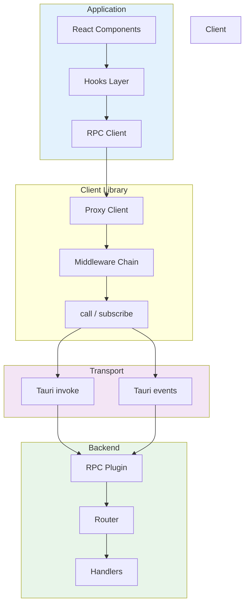
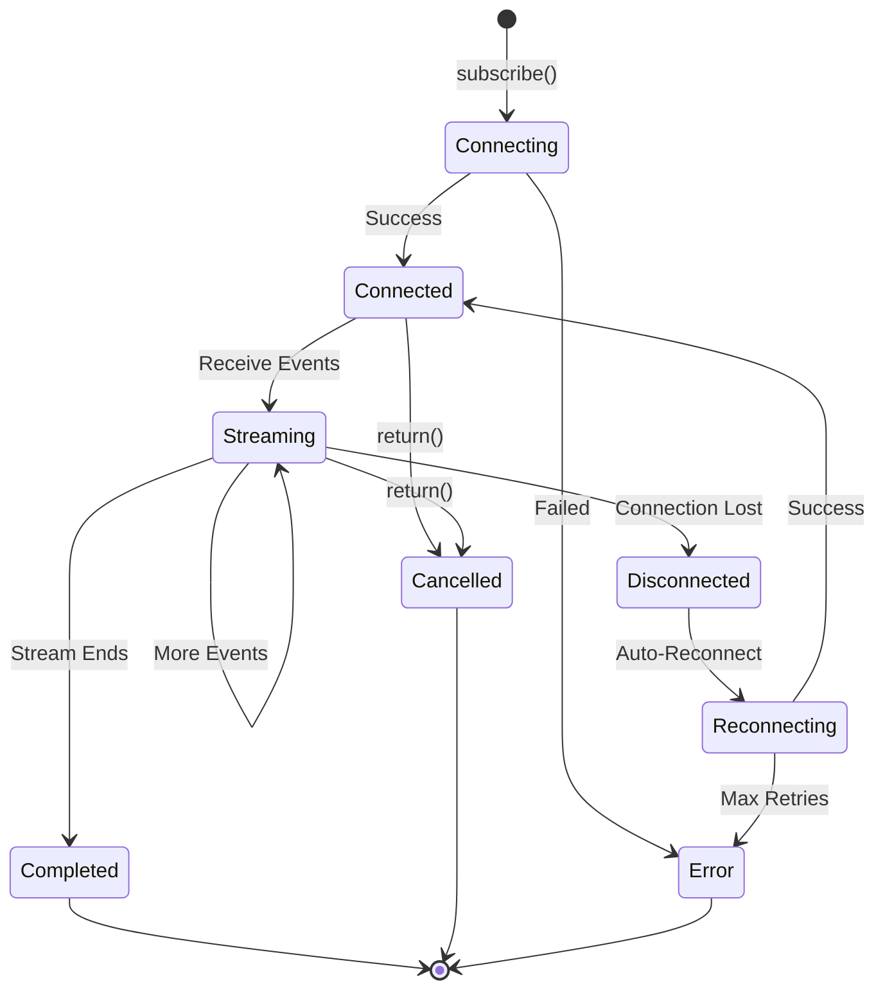
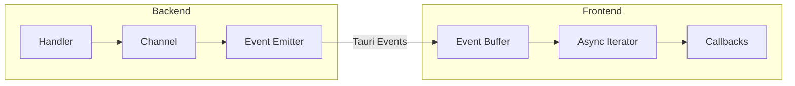
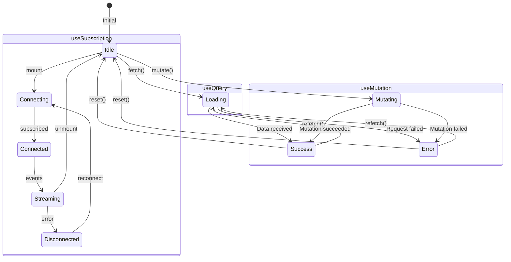
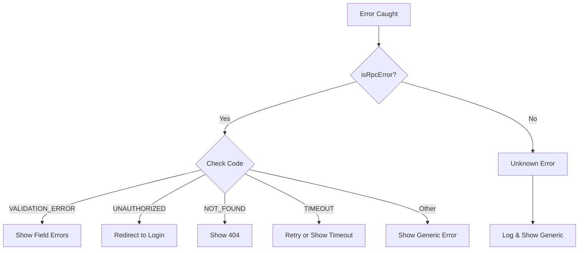

<p align="center">
  
</p>

<h1 align="center">📡 Tauri RPC Client</h1>

<p align="center">
  <strong>A fully type-safe RPC client library for Tauri v2 applications</strong>
</p>

<p align="center">
  <a href="#-features">Features</a> •
  <a href="#-quick-start">Quick Start</a> •
  <a href="#-client-api">Client API</a> •
  <a href="#-subscriptions">Subscriptions</a> •
  <a href="#-react-hooks">React Hooks</a> •
  <a href="#-error-handling">Error Handling</a>
</p>

---

## ✨ Features

| Feature               | Description                                        |
| --------------------- | -------------------------------------------------- |
| 🔒 **Type-Safe**      | Full TypeScript inference from contract definition |
| 🎯 **Contract-First** | Define types once, get safety everywhere           |
| 📡 **Subscriptions**  | Async iterators with auto-reconnect support        |
| ⚛️ **React Hooks**    | `useQuery`, `useMutation`, `useSubscription`       |
| 🔗 **Middleware**     | Extensible request/response pipeline               |
| 🛡️ **Error Handling** | Typed errors with error codes                      |
| 🔄 **Auto-Reconnect** | Resilient subscription connections                 |

---

## 🏗️ Architecture

### Client Flow



### Subscription Lifecycle



---

## 🚀 Quick Start

### 1. Define Your Contract

Create a TypeScript interface that mirrors your Rust types:

```typescript
// src/rpc/contract.ts
import type { ContractRouter } from "../lib/rpc";

// Types (mirror your Rust types)
export interface User {
  id: number;
  name: string;
  email: string;
  createdAt: string;
}

export interface CreateUserInput {
  name: string;
  email: string;
}

export interface CounterInput {
  start: number;
  maxCount: number;
  intervalMs: number;
}

export interface CounterEvent {
  count: number;
  timestamp: string;
}

// Contract definition
export interface RpcContract extends ContractRouter {
  health: {
    type: "query";
    input: void;
    output: { status: string; version: string };
  };

  user: {
    get: { type: "query"; input: { id: number }; output: User };
    list: { type: "query"; input: void; output: User[] };
    create: { type: "mutation"; input: CreateUserInput; output: User };
    delete: {
      type: "mutation";
      input: { id: number };
      output: { success: boolean };
    };
  };

  stream: {
    counter: {
      type: "subscription";
      input: CounterInput;
      output: CounterEvent;
    };
    time: { type: "subscription"; input: void; output: string };
  };
}
```

### 2. Create the Client

```typescript
// src/rpc/client.ts
import { createClient } from "../lib/rpc";
import type { RpcContract } from "./contract";

export const rpc = createClient<RpcContract>({
  subscriptionPaths: ["stream.counter", "stream.time"],
});
```

### 3. Use It!

```typescript
// Queries
const health = await rpc.health();
const user = await rpc.user.get({ id: 1 });
const users = await rpc.user.list();

// Mutations
const newUser = await rpc.user.create({
  name: "Alice",
  email: "alice@example.com",
});

// Subscriptions
const stream = await rpc.stream.counter({
  start: 0,
  maxCount: 100,
  intervalMs: 500,
});

for await (const event of stream) {
  console.log(`Count: ${event.count}`);
}
```

---

## 📡 Client API

### createClient

Create a type-safe RPC client from your contract:

```typescript
import { createClient, type RpcClientConfig } from "../lib/rpc";

const config: RpcClientConfig = {
  // Paths that are subscriptions (required for runtime detection)
  subscriptionPaths: ["stream.counter", "stream.time"],

  // Global request timeout (optional)
  timeout: 30000,

  // Middleware stack (optional)
  middleware: [loggingMiddleware, authMiddleware],

  // Lifecycle callbacks (optional)
  onRequest: (ctx) => console.log("Request:", ctx.path),
  onResponse: (ctx, data) => console.log("Response:", data),
  onError: (ctx, error) => console.error("Error:", error),
};

const rpc = createClient<RpcContract>(config);
```

### call

Make a direct RPC call (query or mutation):

```typescript
import { call } from "../lib/rpc";

// Basic call
const user = await call<User>("user.get", { id: 1 });

// With options
const user = await call<User>(
  "user.get",
  { id: 1 },
  {
    timeout: 5000,
    signal: abortController.signal,
  }
);
```

### subscribe

Create a subscription stream:

```typescript
import { subscribe } from "../lib/rpc";

const stream = await subscribe<CounterEvent>(
  "stream.counter",
  {
    start: 0,
    maxCount: 100,
    intervalMs: 500,
  },
  {
    // Auto-reconnect on disconnect
    autoReconnect: true,
    maxReconnects: 5,
    reconnectDelay: 1000,

    // Resume from last event
    lastEventId: "counter-42",
  }
);

// Consume the stream
for await (const event of stream) {
  console.log(event);
}

// Or manually cleanup
await stream.return();
```

---

## 📡 Subscriptions

### Event Iterator Pattern



### Basic Usage

```typescript
const stream = await subscribe<CounterEvent>("stream.counter", input);

try {
  for await (const event of stream) {
    console.log(`Count: ${event.count}`);

    // Break to stop early
    if (event.count >= 50) break;
  }
} finally {
  // Always cleanup
  await stream.return();
}
```

### With Auto-Reconnect

```typescript
const stream = await subscribe<CounterEvent>("stream.counter", input, {
  autoReconnect: true,
  maxReconnects: 5,
  reconnectDelay: 1000, // Exponential backoff applied
});
```

### consumeEventIterator Helper

For callback-style consumption:

```typescript
import { consumeEventIterator } from "../lib/rpc";

const cancel = consumeEventIterator(
  subscribe<CounterEvent>("stream.counter", input),
  {
    onEvent: (event) => {
      console.log(`Count: ${event.count}`);
    },
    onError: (error) => {
      console.error("Stream error:", error);
    },
    onComplete: () => {
      console.log("Stream completed");
    },
    onFinish: (state) => {
      // state: 'success' | 'error' | 'cancelled'
      console.log(`Finished with state: ${state}`);
    },
  }
);

// Later: cancel the subscription
await cancel();
```

---

## ⚛️ React Hooks

### useQuery

Fetch data with automatic caching and refetching:

```typescript
import { useQuery } from '../lib/rpc';

function UserProfile({ id }: { id: number }) {
  const {
    data,        // User | undefined
    isLoading,   // boolean
    error,       // RpcError | null
    refetch,     // () => Promise<void>
  } = useQuery(
    () => rpc.user.get({ id }),
    [id],  // Dependencies - refetch when id changes
    {
      // Options
      enabled: id > 0,           // Conditional fetching
      refetchInterval: 30000,    // Auto-refetch every 30s
      onSuccess: (user) => console.log('Loaded:', user),
      onError: (error) => console.error('Failed:', error),
    }
  );

  if (isLoading) return <Spinner />;
  if (error) return <Error message={error.message} />;
  if (!data) return null;

  return (
    <div>
      <h1>{data.name}</h1>
      <p>{data.email}</p>
      <button onClick={refetch}>Refresh</button>
    </div>
  );
}
```

### useMutation

Perform write operations with loading and error states:

```typescript
import { useMutation } from '../lib/rpc';

function CreateUserForm() {
  const [name, setName] = useState('');
  const [email, setEmail] = useState('');

  const {
    mutate,      // (input: CreateUserInput) => Promise<User>
    isLoading,   // boolean
    error,       // RpcError | null
    data,        // User | undefined (last successful result)
    reset,       // () => void (clear state)
  } = useMutation(
    (input: CreateUserInput) => rpc.user.create(input),
    {
      onSuccess: (user) => {
        toast.success(`Created ${user.name}`);
        reset();
      },
      onError: (error) => {
        toast.error(error.message);
      },
    }
  );

  const handleSubmit = (e: FormEvent) => {
    e.preventDefault();
    mutate({ name, email });
  };

  return (
    <form onSubmit={handleSubmit}>
      <input
        value={name}
        onChange={(e) => setName(e.target.value)}
        placeholder="Name"
      />
      <input
        value={email}
        onChange={(e) => setEmail(e.target.value)}
        placeholder="Email"
      />
      {error && <p className="error">{error.message}</p>}
      <button type="submit" disabled={isLoading}>
        {isLoading ? 'Creating...' : 'Create User'}
      </button>
    </form>
  );
}
```

### useSubscription

Subscribe to real-time streams:

```typescript
import { useSubscription, subscribe } from '../lib/rpc';

function CounterDisplay() {
  const [events, setEvents] = useState<CounterEvent[]>([]);

  const {
    data,          // CounterEvent | undefined (latest event)
    isConnected,   // boolean
    error,         // RpcError | null
  } = useSubscription<CounterEvent>(
    async () => subscribe('stream.counter', {
      start: 0,
      maxCount: 100,
      intervalMs: 500
    }),
    [],  // Dependencies
    {
      onEvent: (event) => {
        setEvents((prev) => [...prev.slice(-9), event]);
      },
      onError: (error) => {
        console.error('Stream error:', error);
      },
      onComplete: () => {
        console.log('Stream completed');
      },
    }
  );

  return (
    <div>
      <div className={`status ${isConnected ? 'connected' : 'disconnected'}`}>
        {isConnected ? '🟢 Connected' : '🔴 Disconnected'}
      </div>

      {error && <div className="error">{error.message}</div>}

      <div className="counter">
        {data?.count ?? '—'}
      </div>

      <div className="events">
        {events.map((e, i) => (
          <div key={i}>{e.count} - {e.timestamp}</div>
        ))}
      </div>
    </div>
  );
}
```

### Hook State Diagram



---

## 🛡️ Error Handling

### Error Types

```typescript
interface RpcError {
  code: RpcErrorCode | string;
  message: string;
  details?: unknown;
  cause?: string;
}

type RpcErrorCode =
  // Client errors
  | "BAD_REQUEST"
  | "UNAUTHORIZED"
  | "FORBIDDEN"
  | "NOT_FOUND"
  | "VALIDATION_ERROR"
  | "CONFLICT"
  | "PAYLOAD_TOO_LARGE"
  // Server errors
  | "INTERNAL_ERROR"
  | "NOT_IMPLEMENTED"
  | "SERVICE_UNAVAILABLE"
  // RPC errors
  | "PROCEDURE_NOT_FOUND"
  | "SUBSCRIPTION_ERROR"
  | "MIDDLEWARE_ERROR"
  | "SERIALIZATION_ERROR"
  // Client-only
  | "TIMEOUT"
  | "CANCELLED"
  | "UNKNOWN";
```

### Error Utilities

```typescript
import { isRpcError, hasErrorCode, createError } from "../lib/rpc";

try {
  await rpc.user.create(input);
} catch (error) {
  if (isRpcError(error)) {
    // Type-safe error handling
    switch (error.code) {
      case "VALIDATION_ERROR":
        // error.details might contain field info
        showFieldError(error.details?.field);
        break;
      case "CONFLICT":
        showToast("User already exists");
        break;
      case "UNAUTHORIZED":
        redirectToLogin();
        break;
      default:
        showToast(error.message);
    }
  }
}

// Check specific error code
if (hasErrorCode(error, "NOT_FOUND")) {
  showNotFound();
}

// Create custom errors
throw createError("CUSTOM_ERROR", "Something went wrong", {
  field: "email",
});
```

### Error Handling Patterns



---

## 🔗 Middleware

### Creating Middleware

```typescript
import type { Middleware, RequestContext } from "../lib/rpc";

// Logging middleware
const loggingMiddleware: Middleware = async (ctx, next) => {
  const start = Date.now();
  console.log(`→ [${ctx.type}] ${ctx.path}`);

  try {
    const result = await next();
    console.log(`← ${ctx.path} (${Date.now() - start}ms)`);
    return result;
  } catch (error) {
    console.error(`✗ ${ctx.path} - ${error}`);
    throw error;
  }
};

// Auth middleware
const authMiddleware: Middleware = async (ctx, next) => {
  // Add auth token to request
  ctx.meta = {
    ...ctx.meta,
    token: getAuthToken(),
  };
  return next();
};

// Retry middleware
const retryMiddleware: Middleware = async (ctx, next) => {
  let lastError: unknown;

  for (let i = 0; i < 3; i++) {
    try {
      return await next();
    } catch (error) {
      lastError = error;
      if (!isRetryable(error)) throw error;
      await sleep(1000 * Math.pow(2, i));
    }
  }

  throw lastError;
};
```

### Applying Middleware

```typescript
const rpc = createClient<RpcContract>({
  subscriptionPaths: ["stream.counter"],
  middleware: [
    loggingMiddleware, // Executes first
    authMiddleware, // Executes second
    retryMiddleware, // Executes third
  ],
});
```

---

## 🛠️ Utilities

### Path Validation

```typescript
import { validatePath } from "../lib/rpc";

// Valid paths
validatePath("health"); // ✓
validatePath("user.get"); // ✓
validatePath("api.v1.users.list"); // ✓

// Invalid paths (throws VALIDATION_ERROR)
validatePath(""); // ✗ Empty
validatePath(".path"); // ✗ Starts with dot
validatePath("path."); // ✗ Ends with dot
validatePath("path..name"); // ✗ Consecutive dots
validatePath("path/name"); // ✗ Invalid character
```

### Backend Utilities

```typescript
import { getProcedures, getSubscriptionCount } from "../lib/rpc";

// List all available procedures
const procedures = await getProcedures();
// ['health', 'user.get', 'user.list', 'stream.counter', ...]

// Get active subscription count
const count = await getSubscriptionCount();
// 3
```

### Retry Utilities

```typescript
import { withRetry, calculateBackoff, type RetryConfig } from "../lib/rpc";

const config: RetryConfig = {
  maxRetries: 3,
  baseDelay: 1000,
  maxDelay: 10000,
  backoffMultiplier: 2,
};

// Wrap any async function with retry logic
const result = await withRetry(() => rpc.user.get({ id: 1 }), config);

// Calculate backoff delay
const delay = calculateBackoff(attempt, config);
```

---

## 📁 File Structure

```
src/lib/rpc/
├── index.ts           # Public exports
├── types.ts           # TypeScript type definitions
├── client.ts          # RPC client implementation
├── event-iterator.ts  # Subscription handling
├── hooks.ts           # React hooks
├── utils.ts           # Utility functions
└── README.md          # This documentation
```

---

## 📚 Type Reference

### Core Types

| Type               | Description                            |
| ------------------ | -------------------------------------- |
| `RpcError`         | Structured error with code and message |
| `RpcErrorCode`     | Union of standard error codes          |
| `Event<T>`         | Event wrapper with optional metadata   |
| `EventIterator<T>` | Async iterator for subscriptions       |

### Contract Types

| Type                    | Description                        |
| ----------------------- | ---------------------------------- |
| `ContractRouter`        | Base type for contract definitions |
| `QueryDef<I, O>`        | Query procedure definition         |
| `MutationDef<I, O>`     | Mutation procedure definition      |
| `SubscriptionDef<I, O>` | Subscription procedure definition  |

### Client Types

| Type                  | Description                   |
| --------------------- | ----------------------------- |
| `RouterClient<T>`     | Typed client from contract    |
| `RpcClientConfig`     | Client configuration options  |
| `CallOptions`         | Options for queries/mutations |
| `SubscriptionOptions` | Options for subscriptions     |
| `Middleware`          | Middleware function type      |

### Hook Types

| Type                    | Description                    |
| ----------------------- | ------------------------------ |
| `QueryResult<T>`        | Return type of useQuery        |
| `MutationResult<T, I>`  | Return type of useMutation     |
| `SubscriptionResult<T>` | Return type of useSubscription |

---

## 📄 License

MIT © 2024-2026

---

<p align="center">
  <strong>Built with ❤️ for Tauri developers</strong>
</p>
