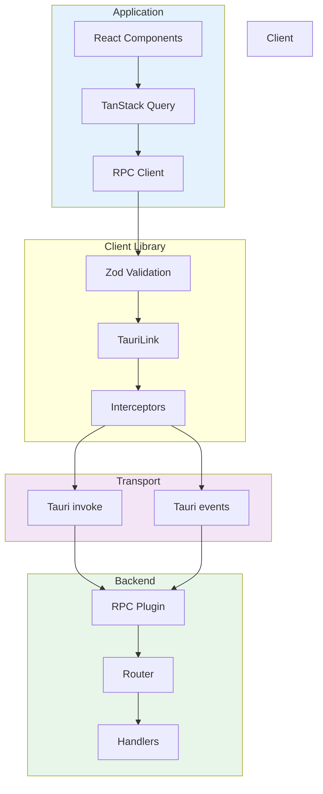

<p align="center">
  
</p>

<h1 align="center">📡 Tauri RPC Client</h1>

<p align="center">
  <strong>A fully type-safe RPC client library for Tauri v2 applications</strong>
</p>

<p align="center">
  <a href="#-features">Features</a> •
  <a href="#-quick-start">Quick Start</a> •
  <a href="#-taurilink">TauriLink</a> •
  <a href="#-zod-validation">Zod Validation</a> •
  <a href="#-tanstack-query">TanStack Query</a> •
  <a href="#-subscriptions">Subscriptions</a> •
  <a href="#-error-handling">Error Handling</a>
</p>

---

## ✨ Features

| Feature               | Description                                         |
| --------------------- | --------------------------------------------------- |
| 🔒 **Type-Safe**      | Full TypeScript inference from contract definition  |
| 🎯 **Contract-First** | Define types once, get safety everywhere            |
| 🛡️ **Zod Validation** | Runtime validation with automatic type inference    |
| 🔗 **TauriLink**      | oRPC-style interceptors and middleware              |
| ⚛️ **TanStack Query** | First-class integration with query/mutation options |
| 📡 **Subscriptions**  | Async iterators with auto-reconnect support         |
| 🔄 **Auto-Reconnect** | Resilient subscription connections                  |

---

## 🏗️ Architecture



---

## 🚀 Quick Start

### Option 1: Simple Contract (TypeScript Types Only)

```typescript
import { createClient, type ContractRouter } from "./lib/rpc";

// Define contract with TypeScript types
interface AppContract extends ContractRouter {
  health: { type: "query"; input: void; output: { status: string } };
  user: {
    get: { type: "query"; input: { id: number }; output: User };
    create: { type: "mutation"; input: CreateUserInput; output: User };
  };
}

// Create client
const rpc = createClient<AppContract>({
  subscriptionPaths: ["stream.events"],
});

// Use with full type safety
const health = await rpc.health();
const user = await rpc.user.get({ id: 1 });
```

### Option 2: Zod Contract (Runtime Validation)

```typescript
import { z } from "zod";
import { procedure, router, createValidatedClient, TauriLink } from "./lib/rpc";

// Define contract with Zod schemas
const contract = router({
  health: procedure()
    .output(z.object({ status: z.string() }))
    .query(),

  user: router({
    get: procedure()
      .input(z.object({ id: z.number() }))
      .output(z.object({ id: z.number(), name: z.string(), email: z.string() }))
      .query(),

    create: procedure()
      .input(z.object({ name: z.string().min(1), email: z.string().email() }))
      .output(z.object({ id: z.number(), name: z.string(), email: z.string() }))
      .mutation(),
  }),
});

// Create validated client
const link = new TauriLink();
const rpc = createValidatedClient(contract, link);

// Inputs/outputs are validated at runtime!
const user = await rpc.user.get({ id: 1 });
```

---

## 🔗 TauriLink

TauriLink provides an oRPC-style link abstraction with interceptors, context, and lifecycle hooks.

### Basic Usage

```typescript
import { TauriLink, createClientFromLink } from "./lib/rpc";

const link = new TauriLink({
  timeout: 30000,
  onRequest: (ctx) => console.log(`→ ${ctx.path}`),
  onResponse: (data, ctx) => console.log(`← ${ctx.path}`),
  onError: (error, ctx) => console.error(`✗ ${ctx.path}:`, error),
});

const client = createClientFromLink<AppContract>(link);
```

### Interceptors

Interceptors wrap requests and can modify context, add headers, retry, log, etc.

```typescript
import { TauriLink, logging, retry, onError } from "./lib/rpc";

const link = new TauriLink({
  interceptors: [
    // Logging interceptor (built-in)
    logging({ prefix: "[RPC]" }),

    // Retry interceptor (built-in)
    retry({ maxRetries: 3, delay: 1000 }),

    // Error handler interceptor (built-in)
    onError((error, ctx) => {
      analytics.track("rpc_error", { path: ctx.path, code: error.code });
    }),

    // Custom auth interceptor
    async (ctx, next) => {
      ctx.meta.authorization = `Bearer ${getToken()}`;
      return next();
    },
  ],
});
```

### Client Context

Pass context per-request for auth tokens, user info, etc.

```typescript
interface ClientContext {
  token?: string;
  userId?: string;
}

const link = new TauriLink<ClientContext>({
  interceptors: [
    async (ctx, next) => {
      if (ctx.context.token) {
        ctx.meta.authorization = `Bearer ${ctx.context.token}`;
      }
      return next();
    },
  ],
});

const client = createClientFromLink<AppContract, ClientContext>(link);

// Call with context
const user = await client.user.get(
  { id: 1 },
  {
    context: { token: "abc123" },
  }
);
```

---

## 🛡️ Zod Validation

Runtime validation with automatic TypeScript type inference from Zod schemas.

### Defining Contracts

```typescript
import { z } from "zod";
import { procedure, router } from "./lib/rpc";

// Define reusable schemas
const UserSchema = z.object({
  id: z.number(),
  name: z.string(),
  email: z.string().email(),
  createdAt: z.string().datetime(),
});

const CreateUserSchema = z.object({
  name: z.string().min(1, "Name is required"),
  email: z.string().email("Invalid email"),
});

// Build contract
const contract = router({
  health: procedure()
    .output(z.object({ status: z.string(), version: z.string() }))
    .query(),

  user: router({
    get: procedure()
      .input(z.object({ id: z.number() }))
      .output(UserSchema)
      .query(),

    list: procedure().output(z.array(UserSchema)).query(),

    create: procedure().input(CreateUserSchema).output(UserSchema).mutation(),

    delete: procedure()
      .input(z.object({ id: z.number() }))
      .output(z.object({ success: z.boolean() }))
      .mutation(),
  }),
});
```

### Creating Validated Client

```typescript
import { createValidatedClient, TauriLink } from "./lib/rpc";

const link = new TauriLink();
const client = createValidatedClient(contract, link, {
  validateInput: true, // Validate inputs before sending
  validateOutput: true, // Validate outputs after receiving
  strict: false, // Allow unknown keys (set true to reject)
  onValidationError: (error, ctx) => {
    console.error(`Validation failed for ${ctx.path}:`, error.issues);
  },
});
```

### Validation Errors

Invalid data produces structured errors:

```typescript
try {
  await client.user.create({ name: "", email: "invalid" });
} catch (error) {
  // error = {
  //   code: "VALIDATION_ERROR",
  //   message: "Input validation failed for user.create",
  //   details: {
  //     type: "input",
  //     path: "user.create",
  //     issues: [
  //       { path: "name", message: "Name is required", code: "too_small" },
  //       { path: "email", message: "Invalid email", code: "invalid_string" }
  //     ]
  //   }
  // }
}
```

### Zod Transforms

Transforms are applied automatically:

```typescript
const contract = router({
  events: procedure()
    .input(
      z.object({
        // String input → Date object
        after: z.string().transform((s) => new Date(s)),
      })
    )
    .output(
      z.array(
        z.object({
          id: z.string(),
          // String response → Date object
          date: z.string().transform((s) => new Date(s)),
        })
      )
    )
    .query(),
});

// Input: { after: "2024-01-01" }
// Transformed to: { after: Date }
// Output dates are also transformed to Date objects
```

### Type Inference

Extract types from your contract:

```typescript
import type { InferContractInputs, InferContractOutputs } from "./lib/rpc";

type Inputs = InferContractInputs<typeof contract>;
type Outputs = InferContractOutputs<typeof contract>;

// Inputs['user']['create'] = { name: string; email: string }
// Outputs['user']['get'] = { id: number; name: string; email: string; createdAt: string }
```

### Merging Routers

Combine multiple routers:

```typescript
const authRouter = router({
  login: procedure()
    .input(z.object({ email: z.string(), password: z.string() }))
    .output(z.object({ token: z.string() }))
    .mutation(),
});

const userRouter = router({
  user: router({
    get: procedure()
      .input(z.object({ id: z.number() }))
      .output(UserSchema)
      .query(),
  }),
});

const contract = mergeRouters(authRouter, userRouter);
// { login: ..., user: { get: ... } }
```

---

## ⚛️ TanStack Query Integration

First-class TanStack Query integration with automatic query/mutation options.

### Setup

```typescript
import { createTanstackQueryUtils } from "./lib/rpc";

// Create utils from your client
const api = createTanstackQueryUtils<AppContract>(rpc);
```

### Query Options

```typescript
import { useQuery } from "@tanstack/react-query";

function UserProfile({ id }: { id: number }) {
  // Generate query options automatically
  const { data, isLoading } = useQuery(
    api.user.get.queryOptions({ input: { id } })
  );

  // Void input procedures
  const { data: health } = useQuery(api.health.queryOptions());

  return <div>{data?.name}</div>;
}
```

### Mutation Options

```typescript
import { useMutation, useQueryClient } from "@tanstack/react-query";

function CreateUserForm() {
  const queryClient = useQueryClient();

  const { mutate, isPending } = useMutation({
    ...api.user.create.mutationOptions(),
    onSuccess: () => {
      // Invalidate user queries
      queryClient.invalidateQueries({ queryKey: api.user.key() });
    },
  });

  return (
    <button onClick={() => mutate({ name: "Alice", email: "alice@example.com" })}>
      {isPending ? "Creating..." : "Create User"}
    </button>
  );
}
```

### Infinite Queries

```typescript
import { useInfiniteQuery } from "@tanstack/react-query";

function UserList() {
  const { data, fetchNextPage, hasNextPage } = useInfiniteQuery(
    api.user.list.infiniteOptions({
      input: (pageParam) => ({ limit: 10, offset: pageParam }),
      initialPageParam: 0,
      getNextPageParam: (lastPage) => lastPage.nextOffset,
    })
  );

  return (
    <div>
      {data?.pages.flatMap(page => page.users).map(user => (
        <div key={user.id}>{user.name}</div>
      ))}
      {hasNextPage && <button onClick={() => fetchNextPage()}>Load More</button>}
    </div>
  );
}
```

### Cache Invalidation

```typescript
// Invalidate all user queries
queryClient.invalidateQueries({ queryKey: api.user.key() });

// Invalidate specific user
queryClient.invalidateQueries({
  queryKey: api.user.get.queryKey({ input: { id: 1 } }),
});

// Invalidate entire API
queryClient.invalidateQueries({ queryKey: api.key() });
```

### Direct Calls

```typescript
// Call procedures directly (bypasses React Query)
const user = await api.user.get.call({ id: 1 });
const newUser = await api.user.create.call({
  name: "Bob",
  email: "bob@example.com",
});
```

---

## 📡 Subscriptions

Async iterators with auto-reconnect support for real-time streaming.

### Basic Usage

```typescript
const stream = await rpc.stream.counter({ start: 0, maxCount: 100 });

for await (const event of stream) {
  console.log(`Count: ${event.count}`);

  // Break to stop early
  if (event.count >= 50) break;
}
```

### With Auto-Reconnect

```typescript
import { subscribe } from "./lib/rpc";

const stream = await subscribe<CounterEvent>("stream.counter", input, {
  autoReconnect: true,
  maxReconnects: 5,
  reconnectDelay: 1000, // Exponential backoff applied
  lastEventId: "event-42", // Resume from last event
});
```

### React Hook

```typescript
import { useSubscription } from "./lib/rpc";

function CounterDisplay() {
  const { data, latestEvent, isConnected, error, unsubscribe, reconnect } =
    useSubscription(
      () => rpc.stream.counter({ start: 0 }),
      [],  // Dependencies
      {
        maxEvents: 100,  // Buffer size
        onEvent: (event) => console.log("Event:", event),
        onError: (error) => console.error("Error:", error),
        onComplete: () => console.log("Stream completed"),
        autoReconnect: true,
      }
    );

  return (
    <div>
      <div className={isConnected ? "connected" : "disconnected"}>
        {isConnected ? "🟢 Connected" : "🔴 Disconnected"}
      </div>
      <div className="counter">{latestEvent?.count ?? "—"}</div>
      <button onClick={unsubscribe}>Stop</button>
      <button onClick={reconnect}>Reconnect</button>
    </div>
  );
}
```

### Callback-Style Consumption

```typescript
import { consumeEventIterator, subscribe } from "./lib/rpc";

const cancel = consumeEventIterator(
  subscribe<CounterEvent>("stream.counter", input),
  {
    onEvent: (event) => console.log("Count:", event.count),
    onError: (error) => console.error("Error:", error),
    onComplete: () => console.log("Completed"),
    onFinish: (state) => console.log("Finished:", state), // 'success' | 'error' | 'cancelled'
  }
);

// Later: cancel the subscription
await cancel();
```

---

## 🛡️ Error Handling

### Error Types

```typescript
interface RpcError {
  code: RpcErrorCode | string;
  message: string;
  details?: unknown;
  cause?: string;
}

type RpcErrorCode =
  // Client errors
  | "BAD_REQUEST"
  | "UNAUTHORIZED"
  | "FORBIDDEN"
  | "NOT_FOUND"
  | "VALIDATION_ERROR"
  | "CONFLICT"
  | "PAYLOAD_TOO_LARGE"
  // Server errors
  | "INTERNAL_ERROR"
  | "NOT_IMPLEMENTED"
  | "SERVICE_UNAVAILABLE"
  // RPC errors
  | "PROCEDURE_NOT_FOUND"
  | "SUBSCRIPTION_ERROR"
  | "MIDDLEWARE_ERROR"
  | "SERIALIZATION_ERROR"
  // Client-only
  | "TIMEOUT"
  | "CANCELLED"
  | "UNKNOWN";
```

### Error Utilities

```typescript
import { isRpcError, hasErrorCode, createError } from "./lib/rpc";

try {
  await rpc.user.create(input);
} catch (error) {
  if (isRpcError(error)) {
    switch (error.code) {
      case "VALIDATION_ERROR":
        showFieldErrors(error.details?.issues);
        break;
      case "UNAUTHORIZED":
        redirectToLogin();
        break;
      case "CONFLICT":
        showToast("User already exists");
        break;
      default:
        showToast(error.message);
    }
  }
}

// Check specific error code
if (hasErrorCode(error, "NOT_FOUND")) {
  showNotFound();
}

// Create custom errors
throw createError("CUSTOM_ERROR", "Something went wrong", { field: "email" });
```

---

## 🛠️ Utilities

### Retry Logic

```typescript
import { withRetry, calculateBackoff, type RetryConfig } from "./lib/rpc";

const config: RetryConfig = {
  maxRetries: 3,
  baseDelay: 1000,
  maxDelay: 10000,
  retryableCodes: ["INTERNAL_ERROR", "TIMEOUT", "UNAVAILABLE"],
  jitter: true,
};

const result = await withRetry(() => rpc.user.get({ id: 1 }), config);
```

### Deduplication

```typescript
import { withDedup, deduplicationKey } from "./lib/rpc";

// Deduplicate concurrent identical requests
const key = deduplicationKey("user.get", { id: 1 });
const result = await withDedup(key, () => rpc.user.get({ id: 1 }));
```

### Path Validation

```typescript
import { validatePath } from "./lib/rpc";

validatePath("health"); // ✓
validatePath("user.get"); // ✓
validatePath("api.v1.users.list"); // ✓

validatePath(""); // ✗ Empty
validatePath(".path"); // ✗ Starts with dot
validatePath("path."); // ✗ Ends with dot
validatePath("path..name"); // ✗ Consecutive dots
```

### Backend Utilities

```typescript
import { getProcedures, getSubscriptionCount } from "./lib/rpc";

const procedures = await getProcedures();
// ['health', 'user.get', 'user.list', 'stream.counter', ...]

const count = await getSubscriptionCount();
// 3
```

---

## 📁 File Structure

```
src/lib/rpc/
├── index.ts           # Public exports
├── types.ts           # Core TypeScript types
├── schema.ts          # Zod validation & contract builder
├── link.ts            # TauriLink & interceptors
├── client.ts          # Legacy client implementation
├── tanstack.ts        # TanStack Query integration
├── hooks.ts           # React hooks (useSubscription)
├── event-iterator.ts  # Subscription handling
├── utils.ts           # Utility functions
└── README.md          # This documentation
```

---

## 📚 API Reference

### Contract Building

| Function                                         | Description                              |
| ------------------------------------------------ | ---------------------------------------- |
| `procedure()`                                    | Start building a Zod-validated procedure |
| `router(routes)`                                 | Create a router from procedures          |
| `mergeRouters(...routers)`                       | Merge multiple routers                   |
| `createValidatedClient(contract, link, config?)` | Create client with validation            |

### TauriLink

| Function                     | Description               |
| ---------------------------- | ------------------------- |
| `new TauriLink(config)`      | Create a new link         |
| `createClientFromLink(link)` | Create client from link   |
| `logging(options?)`          | Logging interceptor       |
| `retry(options?)`            | Retry interceptor         |
| `onError(handler)`           | Error handler interceptor |

### TanStack Query

| Function                           | Description                     |
| ---------------------------------- | ------------------------------- |
| `createTanstackQueryUtils(client)` | Create query utils              |
| `api.*.queryOptions(opts)`         | Generate query options          |
| `api.*.mutationOptions()`          | Generate mutation options       |
| `api.*.infiniteOptions(opts)`      | Generate infinite query options |
| `api.*.key(opts?)`                 | Generate query key              |
| `api.*.call(input?)`               | Direct procedure call           |

### Subscriptions

| Function                                   | Description                |
| ------------------------------------------ | -------------------------- |
| `subscribe(path, input, options?)`         | Create subscription        |
| `useSubscription(fn, deps, options?)`      | React subscription hook    |
| `consumeEventIterator(promise, callbacks)` | Callback-style consumption |

### Utilities

| Function                               | Description                |
| -------------------------------------- | -------------------------- |
| `withRetry(fn, config?)`               | Execute with retry logic   |
| `withDedup(key, fn)`                   | Execute with deduplication |
| `validatePath(path)`                   | Validate procedure path    |
| `isRpcError(error)`                    | Check if error is RpcError |
| `hasErrorCode(error, code)`            | Check error code           |
| `createError(code, message, details?)` | Create RpcError            |

---

## 📄 License

MIT © 2026

---

<p align="center">
  <strong>Built with ❤️ for Tauri developers</strong>
</p>
