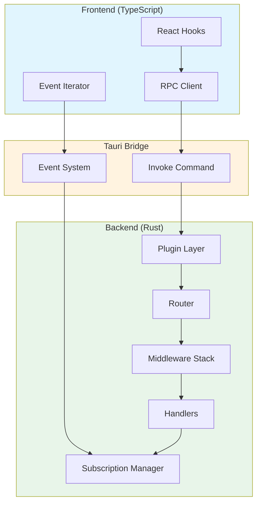
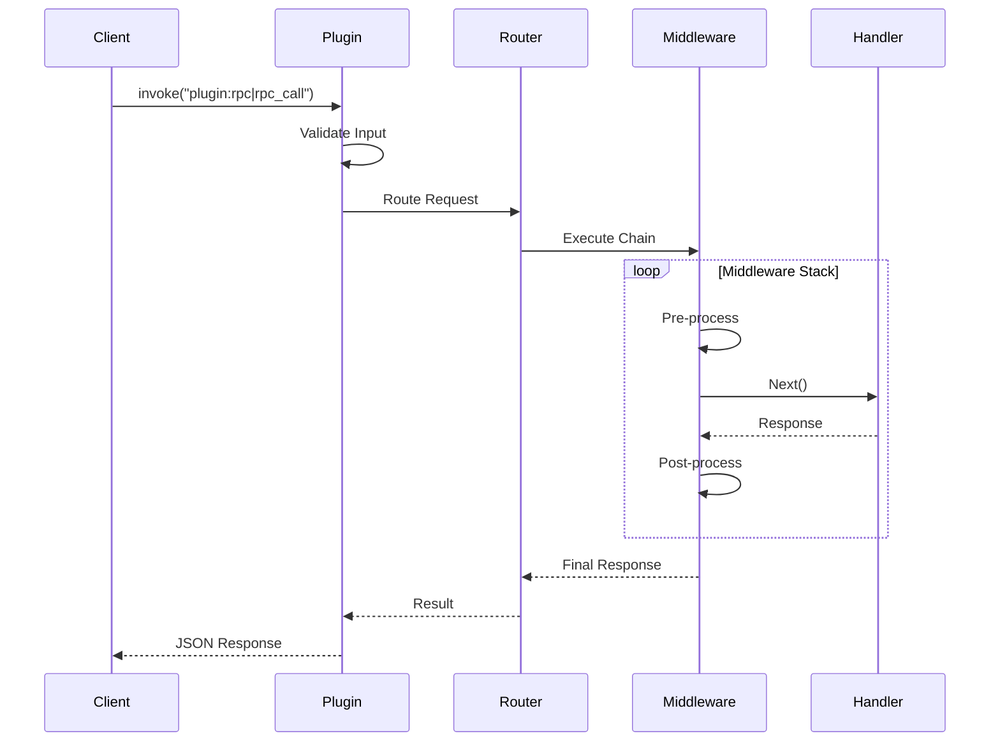
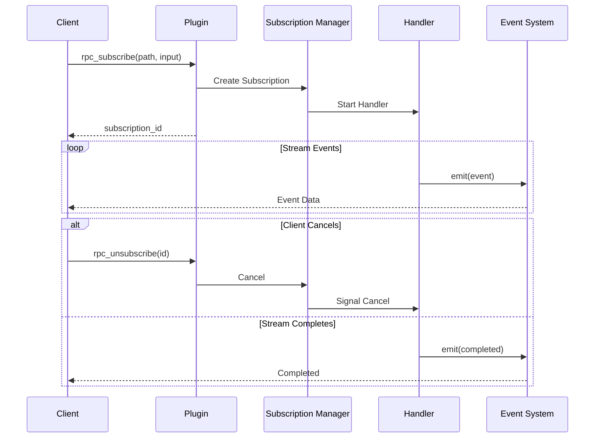
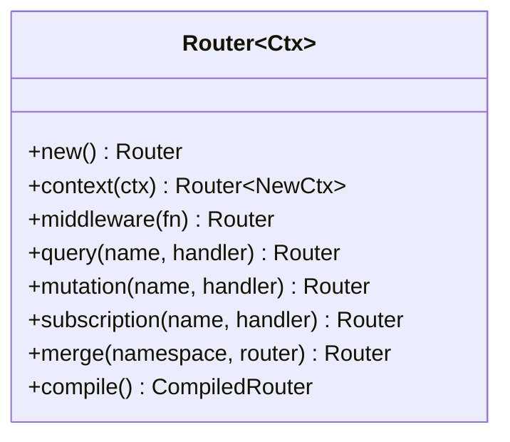
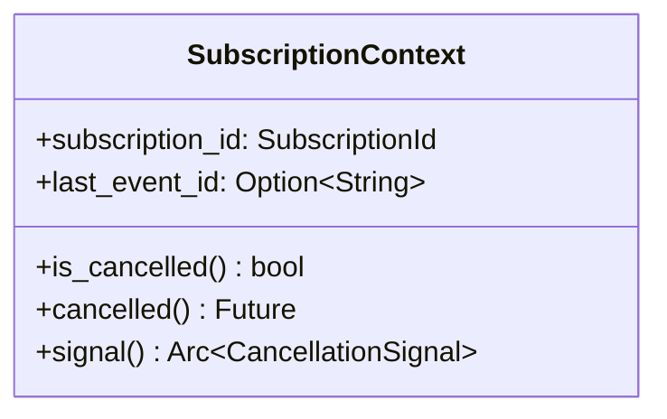
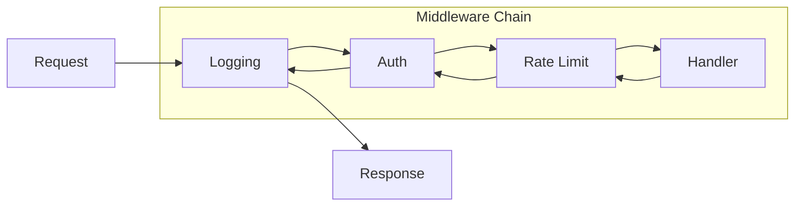
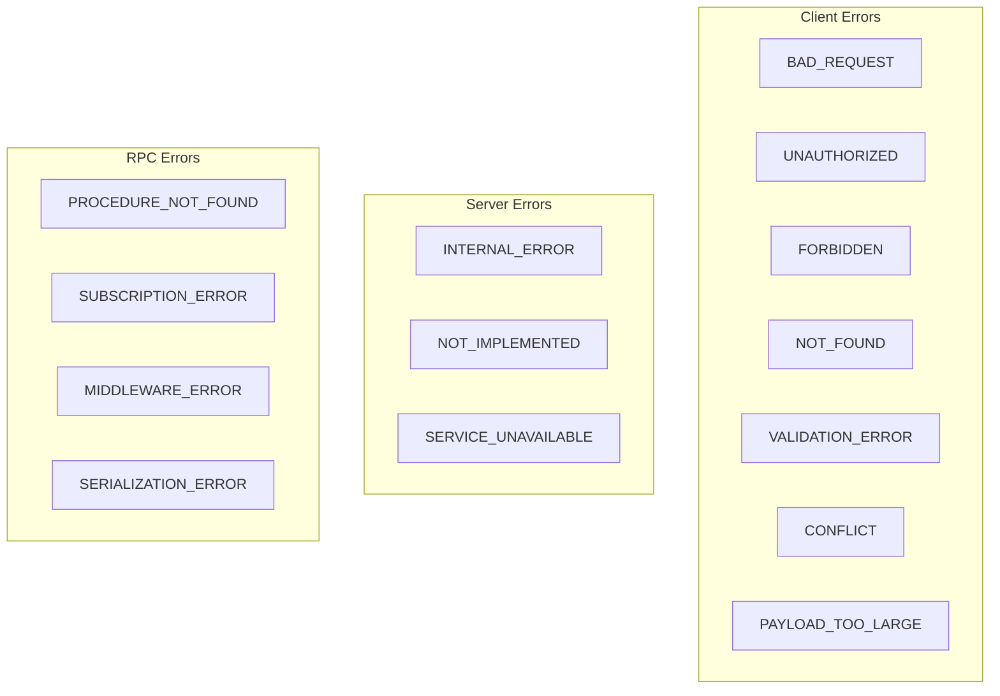
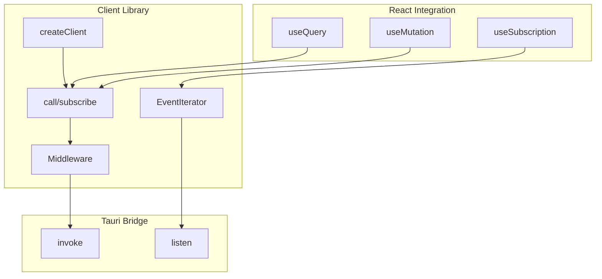

<p align="center">
  
</p>

<h1 align="center">🚀 tauri-plugin-rpc</h1>

<p align="center">
  <strong>A production-ready, type-safe RPC framework for Tauri v2 applications</strong>
</p>

<p align="center">
  <a href="#-features">Features</a> •
  <a href="#-architecture">Architecture</a> •
  <a href="#-installation">Installation</a> •
  <a href="#-quick-start">Quick Start</a> •
  <a href="#-router-api">Router API</a> •
  <a href="#-subscriptions">Subscriptions</a> •
  <a href="#-middleware">Middleware</a> •
  <a href="#-error-handling">Error Handling</a> •
  <a href="#-typescript-client">TypeScript Client</a>
</p>

<p align="center">
  
  
  
  
</p>

---

## ✨ Features

| Feature                   | Description                                              |
| ------------------------- | -------------------------------------------------------- |
| 🔒 **Type-Safe**          | End-to-end type safety from Rust to TypeScript           |
| 🛣️ **Router-Based**       | ORPC-style nested routers with namespacing               |
| 🎯 **Context Injection**  | Dependency injection for services and state              |
| 🔗 **Middleware**         | Async middleware chain with onion-model execution        |
| 📡 **Subscriptions**      | Real-time streaming with backpressure handling           |
| ⚛️ **React Hooks**        | Built-in hooks for queries, mutations, and subscriptions |
| ⚡ **Compiled Routers**   | Pre-computed middleware chains for O(1) execution        |
| 🛡️ **Error Handling**     | Structured error codes with detailed messages            |
| 📦 **Zero Codegen**       | No build step required - just mirror your types          |
| ✅ **Input Validation**   | Built-in validation framework with common rules          |
| 📦 **Batch Processing**   | Execute multiple RPC calls in a single request           |
| ⏱️ **Rate Limiting**      | Configurable rate limits with multiple strategies        |
| 📝 **Structured Logging** | Request/response logging with field redaction            |
| 🔐 **Auth Middleware**    | Authentication and role-based authorization              |
| 💾 **Caching Layer**      | LRU cache with TTL and pattern-based invalidation        |
| 📋 **Schema Export**      | Export router schema as JSON or OpenAPI format           |
| 🏗️ **Procedure Builder**  | Fluent API for per-procedure middleware and validation   |

---

## 🏗️ Architecture

### System Overview



### Request Flow



### Subscription Flow



---

## 📦 Installation

### Cargo.toml

```toml
[dependencies]
tauri-plugin-rpc = { path = "../tauri-plugin-rpc" }
```

### Capabilities (src-tauri/capabilities/default.json)

```json
{
  "permissions": ["core:default", "rpc:default"]
}
```

---

## 🚀 Quick Start

### Step 1: Define Your Context

The context holds your application services and is injected into every handler.

```rust
// src-tauri/src/rpc/context.rs
use std::sync::Arc;
use tokio::sync::RwLock;

#[derive(Clone)]
pub struct AppContext {
    pub db: Arc<RwLock<Database>>,
    pub config: AppConfig,
}

impl AppContext {
    pub fn new() -> Self {
        Self {
            db: Arc::new(RwLock::new(Database::new())),
            config: AppConfig::default(),
        }
    }
}
```

### Step 2: Create Handlers

Handlers are async functions that receive context and input, returning a result.

```rust
// src-tauri/src/rpc/handlers.rs
use tauri_plugin_rpc::prelude::*;

// Query - Read-only operation
async fn get_user(ctx: Context<AppContext>, input: GetUserInput) -> RpcResult<User> {
    let db = ctx.db.read().await;
    db.get_user(input.id)
        .ok_or_else(|| RpcError::not_found(format!("User {} not found", input.id)))
}

// Mutation - Write operation
async fn create_user(ctx: Context<AppContext>, input: CreateUserInput) -> RpcResult<User> {
    // Validation
    if input.name.trim().is_empty() {
        return Err(RpcError::validation("Name is required"));
    }
    if !input.email.contains('@') {
        return Err(RpcError::validation("Invalid email format"));
    }

    let mut db = ctx.db.write().await;
    db.create_user(&input.name, &input.email)
}

// Handler with no input - use NoInput type
async fn health_check(_ctx: Context<AppContext>, _: NoInput) -> RpcResult<HealthResponse> {
    Ok(HealthResponse {
        status: "healthy".into(),
        version: env!("CARGO_PKG_VERSION").into(),
    })
}
```

### Step 3: Build Your Router

```rust
pub fn create_router() -> Router<AppContext> {
    Router::new()
        .context(AppContext::new())
        .middleware(logging)           // Add middleware
        .query("health", health_check) // Root-level query
        .merge("user", user_router())  // Nested router
        .merge("stream", stream_router())
}

fn user_router() -> Router<AppContext> {
    Router::new()
        .context(AppContext::new())
        .query("get", get_user)        // user.get
        .query("list", list_users)     // user.list
        .mutation("create", create_user) // user.create
        .mutation("delete", delete_user) // user.delete
}
```

### Step 4: Register the Plugin

```rust
// src-tauri/src/lib.rs
mod rpc;

pub fn run() {
    tauri::Builder::default()
        .plugin(tauri_plugin_rpc::init(rpc::create_router()))
        .run(tauri::generate_context!())
        .expect("error while running tauri application");
}
```

---

## 🛣️ Router API

### Router Methods



| Method                        | Description                   | Example                                 |
| ----------------------------- | ----------------------------- | --------------------------------------- |
| `context(ctx)`                | Set the context for handlers  | `.context(AppContext::new())`           |
| `middleware(fn)`              | Add middleware to the chain   | `.middleware(logging)`                  |
| `query(name, handler)`        | Add a read-only procedure     | `.query("get", get_user)`               |
| `mutation(name, handler)`     | Add a write procedure         | `.mutation("create", create_user)`      |
| `subscription(name, handler)` | Add a streaming procedure     | `.subscription("events", event_stream)` |
| `merge(namespace, router)`    | Merge another router          | `.merge("user", user_router())`         |
| `compile()`                   | Pre-compute middleware chains | `.compile()`                            |

### Compiled Router (Performance Optimization)

For production, compile your router to pre-build middleware chains:

```rust
let router = Router::new()
    .context(AppContext::new())
    .middleware(logging)
    .middleware(auth)
    .query("health", health_check)
    .compile();  // ⚡ Pre-compute middleware chains

tauri::Builder::default()
    .plugin(tauri_plugin_rpc::init(router))
```

**Benefits:**

- O(1) middleware chain lookup
- No per-request chain construction
- Reduced memory allocations

---

## 📡 Subscriptions

### Creating a Subscription Handler

```rust
use tauri_plugin_rpc::prelude::*;
use async_stream::stream;
use std::pin::pin;
use tokio_stream::StreamExt;

async fn counter_stream(
    _ctx: Context<AppContext>,
    sub_ctx: SubscriptionContext,
    input: CounterInput,
) -> RpcResult<EventStream<CounterEvent>> {
    let (tx, rx) = event_channel(32);

    tokio::spawn(async move {
        let event_stream = stream! {
            let mut count = input.start;
            let mut ticker = tokio::time::interval(
                Duration::from_millis(input.interval_ms)
            );

            loop {
                ticker.tick().await;

                if count >= input.start + input.max_count {
                    break;
                }

                yield Event::with_id(
                    CounterEvent { count, timestamp: Utc::now().to_rfc3339() },
                    format!("counter-{}", count)
                );
                count += 1;
            }
        };

        let mut pinned = pin!(event_stream);
        while let Some(event) = pinned.next().await {
            if sub_ctx.is_cancelled() {
                break;
            }
            if tx.send(event).await.is_err() {
                break;
            }
        }
    });

    Ok(rx)
}
```

### Subscription with No Input

Use `NoInput` for subscriptions that don't require parameters:

```rust
async fn time_stream(
    _ctx: Context<AppContext>,
    sub_ctx: SubscriptionContext,
    _: NoInput,  // Accepts both {} and null from frontend
) -> RpcResult<EventStream<String>> {
    // ...
}
```

### Subscription Context



| Property/Method   | Description                     |
| ----------------- | ------------------------------- |
| `subscription_id` | Unique ID for this subscription |
| `last_event_id`   | Last event ID for resumption    |
| `is_cancelled()`  | Check if client disconnected    |
| `cancelled()`     | Async wait for cancellation     |

---

## 🔗 Middleware

### Middleware Execution Model



### Creating Middleware

```rust
use tauri_plugin_rpc::middleware::{Request, Response, Next};

async fn logging(
    ctx: Context<AppContext>,
    req: Request,
    next: Next<AppContext>,
) -> RpcResult<Response> {
    let start = std::time::Instant::now();
    let path = req.path.clone();
    let proc_type = req.procedure_type.clone();

    println!("→ [{:?}] {}", proc_type, path);

    let result = next(ctx, req).await;
    let duration = start.elapsed();

    match &result {
        Ok(_) => println!("← {} ({:?})", path, duration),
        Err(e) => println!("✗ {} - {} ({:?})", path, e.code, duration),
    }

    result
}

async fn auth(
    ctx: Context<AppContext>,
    req: Request,
    next: Next<AppContext>,
) -> RpcResult<Response> {
    // Skip auth for public endpoints
    if req.path == "health" {
        return next(ctx, req).await;
    }

    // Check authentication
    let token = req.input.get("token")
        .and_then(|v| v.as_str());

    match token {
        Some(t) if is_valid_token(t) => next(ctx, req).await,
        _ => Err(RpcError::unauthorized("Invalid or missing token")),
    }
}
```

### Applying Middleware

```rust
Router::new()
    .middleware(logging)    // Executes first (outermost)
    .middleware(auth)       // Executes second
    .middleware(rate_limit) // Executes third (innermost)
    .query("protected", protected_handler)
```

---

## ✅ Input Validation

### Implementing the Validate Trait

```rust
use tauri_plugin_rpc::prelude::*;

#[derive(Debug, Deserialize)]
pub struct CreateUserInput {
    pub name: String,
    pub email: String,
    pub age: Option<i32>,
}

impl Validate for CreateUserInput {
    fn validate(&self) -> ValidationResult {
        ValidationRules::new()
            .required("name", &self.name)
            .min_length("name", &self.name, 2)
            .max_length("name", &self.name, 100)
            .email("email", &self.email)
            .range("age", self.age.unwrap_or(0) as i64, 0, 150)
            .validate()
    }
}
```

### Using Validated Handlers

```rust
// Register with automatic validation
Router::new()
    .context(AppContext::new())
    .mutation_validated("user.create", create_user)  // Auto-validates input
```

### Validation Rules

| Rule         | Description                | Example                                     |
| ------------ | -------------------------- | ------------------------------------------- |
| `required`   | Field must not be empty    | `.required("name", &self.name)`             |
| `min_length` | Minimum string length      | `.min_length("name", &self.name, 2)`        |
| `max_length` | Maximum string length      | `.max_length("name", &self.name, 100)`      |
| `range`      | Numeric range (inclusive)  | `.range("age", age, 0, 150)`                |
| `pattern`    | Regex pattern match        | `.pattern("code", &self.code, r"^[A-Z]+$")` |
| `email`      | Valid email format         | `.email("email", &self.email)`              |
| `custom`     | Custom validation function | `.custom(\|_\| None)`                       |

---

## 📦 Batch Processing

### Sending Batch Requests

```rust
use tauri_plugin_rpc::prelude::*;

// Configure batch processing
let config = BatchConfig::new()
    .with_max_size(100);  // Max 100 requests per batch

// Execute batch on compiled router
let requests = BatchRequest::new()
    .add("req-1", "user.get", json!({"id": 1}))
    .add("req-2", "user.get", json!({"id": 2}))
    .add("req-3", "user.list", json!({}));

let response = router.call_batch(requests, &config).await;

// Results maintain order
for result in response.results {
    match result.data {
        BatchResultData::Success(value) => println!("{}: {:?}", result.id, value),
        BatchResultData::Error(error) => println!("{}: Error - {}", result.id, error.message),
    }
}
```

### TypeScript Batch Calls

```typescript
const results = await callBatch([
  { id: "1", path: "user.get", input: { id: 1 } },
  { id: "2", path: "user.get", input: { id: 2 } },
  { id: "3", path: "user.list", input: {} },
]);
```

---

## ⏱️ Rate Limiting

### Configuring Rate Limits

```rust
use tauri_plugin_rpc::prelude::*;

let config = RateLimitConfig::new()
    .with_default_limit(RateLimit::new(100, Duration::from_secs(60)))  // 100 req/min
    .with_procedure_limit(
        "user.create",
        RateLimit::new(10, Duration::from_secs(60))  // 10 creates/min
    );

let limiter = RateLimiter::new(config);
```

### Rate Limit Strategies

| Strategy        | Description                                 |
| --------------- | ------------------------------------------- |
| `FixedWindow`   | Reset counter at fixed intervals            |
| `SlidingWindow` | Rolling window for smoother rate limiting   |
| `TokenBucket`   | Allows bursts with configurable refill rate |

### Using Rate Limit Middleware

```rust
use tauri_plugin_rpc::rate_limit::rate_limit_middleware;

let limiter = Arc::new(RateLimiter::new(config));

Router::new()
    .middleware_fn(rate_limit_middleware(limiter))
    .query("api.endpoint", handler)
```

---

## 📝 Structured Logging

### Configuring Logging

```rust
use tauri_plugin_rpc::prelude::*;

let log_config = LogConfig::new()
    .with_level(LogLevel::Info)
    .with_redacted_fields(vec!["password", "token", "secret"])
    .with_excluded_paths(vec!["health"]);  // Don't log health checks
```

### Using Logging Middleware

```rust
use tauri_plugin_rpc::logging::logging_middleware;

Router::new()
    .middleware_fn(logging_middleware(log_config))
    .query("user.get", get_user)
```

### Request IDs

Every request gets a unique UUID for tracing:

```rust
let request_id = RequestId::new();  // Generates UUID v4
println!("Request: {}", request_id);  // Request: 550e8400-e29b-41d4-a716-446655440000
```

---

## 🔐 Authentication & Authorization

### Setting Up Auth

```rust
use tauri_plugin_rpc::prelude::*;

// Define auth rules
let auth_config = AuthConfig::new()
    .public("health")                           // No auth required
    .public("user.login")
    .requires_auth("user.*")                    // Auth required
    .requires_roles("admin.*", vec!["admin"]);  // Admin role required

// Create auth provider
struct MyAuthProvider;

impl AuthProvider for MyAuthProvider {
    async fn authenticate(&self, request: &Request) -> AuthResult {
        // Validate token from request
        if let Some(token) = request.input.get("token").and_then(|v| v.as_str()) {
            if is_valid_token(token) {
                return AuthResult::authenticated("user-123")
                    .with_roles(vec!["user", "admin"]);
            }
        }
        AuthResult::unauthenticated()
    }
}
```

### Using Auth Middleware

```rust
use tauri_plugin_rpc::auth::{auth_middleware, auth_with_config};

// Simple auth (just checks authentication)
Router::new()
    .middleware_fn(auth_middleware(Arc::new(MyAuthProvider)))
    .query("protected", protected_handler)

// Auth with role-based rules
Router::new()
    .middleware_fn(auth_with_config(Arc::new(MyAuthProvider), auth_config))
    .query("admin.users", admin_handler)
```

---

## 💾 Caching Layer

### Configuring Cache

```rust
use tauri_plugin_rpc::prelude::*;

let cache_config = CacheConfig::new()
    .with_default_ttl(Duration::from_secs(300))  // 5 min default
    .with_max_entries(1000)                       // LRU eviction at 1000 entries
    .with_procedure_ttl("user.profile", Duration::from_secs(60))
    .with_excluded_pattern("admin.*");            // Don't cache admin queries

let cache = Cache::new(cache_config);
```

### Using Cache Middleware

```rust
use tauri_plugin_rpc::cache::{cache_middleware, invalidation_middleware};

let cache = Arc::new(Cache::new(cache_config));

Router::new()
    .middleware_fn(cache_middleware(cache.clone()))        // Cache queries
    .middleware_fn(invalidation_middleware(cache.clone())) // Invalidate on mutations
    .query("user.get", get_user)
    .mutation("user.update", update_user)  // Invalidates user.* cache
```

### Manual Cache Operations

```rust
// Get cached value
if let Some(value) = cache.get("user.get:{\"id\":1}") {
    return Ok(value);
}

// Invalidate specific key
cache.invalidate("user.get:{\"id\":1}");

// Invalidate by pattern
cache.invalidate_pattern("user.*");

// Clear all
cache.invalidate_all();
```

---

## 📋 Schema Export

### Exporting Router Schema

```rust
use tauri_plugin_rpc::prelude::*;

// Build schema manually
let schema = SchemaBuilder::new()
    .version("1.0.0")
    .name("My API")
    .description("User management API")
    .query("user.get", ProcedureSchema::query()
        .with_description("Get user by ID")
        .with_input(TypeSchema::object()
            .with_property("id", TypeSchema::integer())
            .with_required("id"))
        .with_output(TypeSchema::object()
            .with_property("id", TypeSchema::integer())
            .with_property("name", TypeSchema::string())
            .with_property("email", TypeSchema::string().with_format("email"))))
    .mutation("user.create", ProcedureSchema::mutation()
        .with_description("Create a new user")
        .with_tag("users"))
    .build();

// Export as JSON
let json = schema.to_json_pretty();
println!("{}", json);

// Export as OpenAPI 3.0.3
let openapi = schema.to_openapi();
let openapi_json = openapi.to_json_pretty();
```

### TypeSchema Types

| Type      | Description       | Example                          |
| --------- | ----------------- | -------------------------------- |
| `string`  | String value      | `TypeSchema::string()`           |
| `number`  | Floating point    | `TypeSchema::number()`           |
| `integer` | Integer value     | `TypeSchema::integer()`          |
| `boolean` | Boolean value     | `TypeSchema::boolean()`          |
| `object`  | Object with props | `TypeSchema::object()`           |
| `array`   | Array of items    | `TypeSchema::array(item_schema)` |
| `null`    | Null value        | `TypeSchema::null()`             |

---

## 🏗️ Procedure Builder API

### Fluent Procedure Definition

```rust
use tauri_plugin_rpc::prelude::*;

Router::new()
    .context(AppContext::new())
    // Using procedure builder
    .procedure("user.create")
        .input_validated::<CreateUserInput>()  // Auto-validation
        .use_middleware(logging)               // Per-procedure middleware
        .use_middleware(rate_limit)
        .mutation(create_user)
    // Context transformation
    .procedure("admin.action")
        .context(|ctx: Context<AppContext>| async move {
            // Transform context for this procedure
            Ok(AdminContext::from(ctx.inner().clone()))
        })
        .mutation(admin_action)
```

### Procedure Builder Methods

| Method              | Description                          |
| ------------------- | ------------------------------------ |
| `input<T>()`        | Set input type                       |
| `input_validated()` | Set input type with auto-validation  |
| `use_middleware()`  | Add per-procedure middleware         |
| `output()`          | Add output transformer               |
| `context()`         | Transform context for this procedure |
| `query()`           | Register as query                    |
| `mutation()`        | Register as mutation                 |
| `subscription()`    | Register as subscription             |

---

## 🛡️ Error Handling

### Error Codes



### Error Constructors

```rust
// Client errors
RpcError::bad_request("Invalid request format")
RpcError::unauthorized("Authentication required")
RpcError::forbidden("Access denied")
RpcError::not_found("Resource not found")
RpcError::validation("Email is required")
RpcError::conflict("User already exists")
RpcError::payload_too_large("Request body too large")

// Server errors
RpcError::internal("Something went wrong")
RpcError::not_implemented("Feature coming soon")
RpcError::service_unavailable("Service temporarily unavailable")

// With details
RpcError::validation("Invalid input")
    .with_details(json!({
        "field": "email",
        "reason": "must be a valid email address"
    }))
```

### Error Structure

```rust
pub struct RpcError {
    pub code: RpcErrorCode,
    pub message: String,
    pub details: Option<serde_json::Value>,
    pub cause: Option<String>,
}
```

---

## 🌐 TypeScript Client

### Client Architecture



### Creating a Typed Client

```typescript
// Define your contract (mirrors Rust types)
interface RpcContract {
  health: { type: "query"; input: void; output: HealthResponse };
  user: {
    get: { type: "query"; input: { id: number }; output: User };
    list: { type: "query"; input: void; output: User[] };
    create: { type: "mutation"; input: CreateUserInput; output: User };
    delete: {
      type: "mutation";
      input: { id: number };
      output: SuccessResponse;
    };
  };
  stream: {
    counter: {
      type: "subscription";
      input: CounterInput;
      output: CounterEvent;
    };
    time: { type: "subscription"; input: void; output: string };
  };
}

// Create the client
const rpc = createClient<RpcContract>({
  subscriptionPaths: ["stream.counter", "stream.time"],
});

// Use with full type safety!
const health = await rpc.health();
const user = await rpc.user.get({ id: 1 });
const users = await rpc.user.list();
```

### Subscriptions

```typescript
// Async iterator pattern
const stream = await rpc.stream.counter({
  start: 0,
  maxCount: 100,
  intervalMs: 500,
});

for await (const event of stream) {
  console.log(`Count: ${event.count}`);
}

// With cleanup
const stream = await subscribe<CounterEvent>("stream.counter", input);

try {
  for await (const event of stream) {
    if (shouldStop) break;
    handleEvent(event);
  }
} finally {
  await stream.return(); // Cleanup
}
```

### React Hooks

```tsx
// Query hook
function UserProfile({ id }: { id: number }) {
  const { data, isLoading, error, refetch } = useQuery(
    () => rpc.user.get({ id }),
    [id]
  );

  if (isLoading) return <Spinner />;
  if (error) return <Error message={error.message} />;

  return (
    <div>
      <h1>{data.name}</h1>
      <button onClick={refetch}>Refresh</button>
    </div>
  );
}

// Mutation hook
function CreateUserForm() {
  const { mutate, isLoading, error } = useMutation(rpc.user.create, {
    onSuccess: (user) => toast.success(`Created ${user.name}`),
    onError: (error) => toast.error(error.message),
  });

  return (
    <form
      onSubmit={(e) => {
        e.preventDefault();
        mutate({ name, email });
      }}
    >
      {/* form fields */}
    </form>
  );
}

// Subscription hook
function CounterDisplay() {
  const { data, isConnected, error } = useSubscription<CounterEvent>(
    () => subscribe("stream.counter", { start: 0, maxCount: 100 }),
    [],
    { onEvent: (event) => console.log(event) }
  );

  return (
    <div>
      <span className={isConnected ? "connected" : "disconnected"} />
      <span>{data?.count ?? "—"}</span>
    </div>
  );
}
```

---

## ⚙️ Configuration

### RpcConfig Options

```rust
use tauri_plugin_rpc::{RpcConfig, BackpressureStrategy};

let config = RpcConfig::new()
    // Input validation
    .with_max_input_size(1024 * 1024)  // 1MB max input

    // Subscription settings
    .with_channel_buffer(64)           // Event buffer size
    .with_backpressure_strategy(BackpressureStrategy::DropOldest)

    // Debugging
    .with_debug_logging(true);

tauri::Builder::default()
    .plugin(tauri_plugin_rpc::init_with_config(router, config))
```

### Backpressure Strategies

| Strategy     | Description                                   |
| ------------ | --------------------------------------------- |
| `Block`      | Block sender until buffer has space (default) |
| `DropOldest` | Drop oldest events when buffer is full        |
| `DropNewest` | Drop new events when buffer is full           |

---

## 📁 Project Structure

```
your-app/
├── src-tauri/
│   ├── src/
│   │   ├── lib.rs                 # Plugin registration
│   │   └── rpc/
│   │       ├── mod.rs             # Module exports
│   │       ├── context.rs         # App context & services
│   │       ├── handlers.rs        # Router & handlers
│   │       └── types.rs           # Rust types
│   └── capabilities/
│       └── default.json           # Permissions
│
├── src/
│   ├── lib/
│   │   └── rpc/
│   │       ├── index.ts           # Library exports
│   │       ├── types.ts           # TypeScript types
│   │       ├── client.ts          # RPC client
│   │       ├── event-iterator.ts  # Subscription handling
│   │       └── hooks.ts           # React hooks
│   └── rpc/
│       └── contract.ts            # Your contract definition
│
└── tauri-plugin-rpc/              # The plugin
    └── src/
        ├── lib.rs                 # Plugin exports
        ├── router.rs              # Router implementation
        ├── context.rs             # Context types
        ├── handler.rs             # Handler trait
        ├── middleware.rs          # Middleware types
        ├── subscription.rs        # Subscription system
        ├── error.rs               # Error types & transformers
        ├── plugin.rs              # Tauri integration
        ├── config.rs              # Configuration
        ├── types.rs               # Common types (NoInput, etc.)
        ├── validation.rs          # Input validation framework
        ├── batch.rs               # Batch request processing
        ├── rate_limit.rs          # Rate limiting strategies
        ├── logging.rs             # Structured logging
        ├── auth.rs                # Authentication & authorization
        ├── cache.rs               # LRU caching layer
        ├── schema.rs              # Schema export (JSON/OpenAPI)
        └── procedure.rs           # Procedure builder API
```

---

## 📚 API Reference

### Prelude Exports

```rust
use tauri_plugin_rpc::prelude::*;

// This imports:
// - Router, CompiledRouter
// - Context, EmptyContext
// - RpcError, RpcErrorCode, RpcResult
// - Handler, Middleware, Next, Request
// - Event, EventStream, EventSender, event_channel
// - SubscriptionContext, SubscriptionHandler
// - NoInput, SuccessResponse, PaginatedResponse
// - init, init_with_config
// - Validation: Validate, ValidationResult, ValidationRules, FieldError
// - Batch: BatchConfig, BatchRequest, BatchResponse, BatchResult
// - Rate Limiting: RateLimiter, RateLimitConfig, RateLimit, RateLimitStrategy
// - Logging: LogConfig, LogEntry, LogLevel, RequestId, RequestMeta
// - Auth: AuthProvider, AuthResult, AuthConfig, AuthRule
// - Cache: Cache, CacheConfig, CacheEntry, CacheStats
// - Schema: RouterSchema, ProcedureSchema, TypeSchema, OpenApiSchema, SchemaBuilder
// - Procedure Builder: ProcedureBuilder, ProcedureChain, RegisteredProcedure
// - And more...
```

### Key Types

| Type                  | Description                               |
| --------------------- | ----------------------------------------- |
| `Router<Ctx>`         | Builder for defining procedures           |
| `CompiledRouter<Ctx>` | Optimized router with pre-built chains    |
| `Context<Ctx>`        | Wrapper providing access to app context   |
| `RpcResult<T>`        | Result type alias for handlers            |
| `RpcError`            | Structured error with code and message    |
| `NoInput`             | Empty input type (accepts `{}` or `null`) |
| `EventStream<T>`      | Channel receiver for subscription events  |
| `SubscriptionContext` | Context for subscription handlers         |
| `ValidationResult`    | Result of input validation                |
| `BatchRequest`        | Container for batch RPC calls             |
| `RateLimiter`         | Rate limiting state manager               |
| `LogConfig`           | Logging configuration                     |
| `AuthResult`          | Authentication result with roles          |
| `Cache`               | LRU cache with TTL support                |
| `RouterSchema`        | Schema for router documentation           |
| `ProcedureBuilder`    | Fluent builder for procedures             |

---

## 🧪 Testing

```rust
#[cfg(test)]
mod tests {
    use super::*;

    #[tokio::test]
    async fn test_get_user() {
        let ctx = Context::new(AppContext::new());
        let input = GetUserInput { id: 1 };

        let result = get_user(ctx, input).await;

        assert!(result.is_ok());
        assert_eq!(result.unwrap().id, 1);
    }

    #[tokio::test]
    async fn test_validation_error() {
        let ctx = Context::new(AppContext::new());
        let input = CreateUserInput {
            name: "".into(),
            email: "test@example.com".into()
        };

        let result = create_user(ctx, input).await;

        assert!(result.is_err());
        assert_eq!(result.unwrap_err().code, RpcErrorCode::ValidationError);
    }
}
```

---

## 📄 License

MIT © 2026

---

<p align="center">
  <strong>Built with ❤️ for the Tauri ecosystem</strong>
</p>

<p align="center">
  <a href="https://github.com/tauri-apps/tauri">Tauri</a> •
  <a href="https://www.rust-lang.org/">Rust</a> •
  <a href="https://www.typescriptlang.org/">TypeScript</a>
</p>
